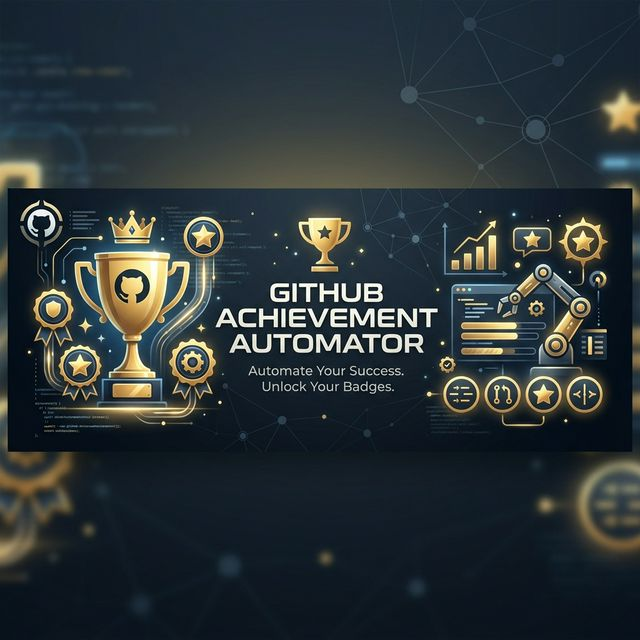
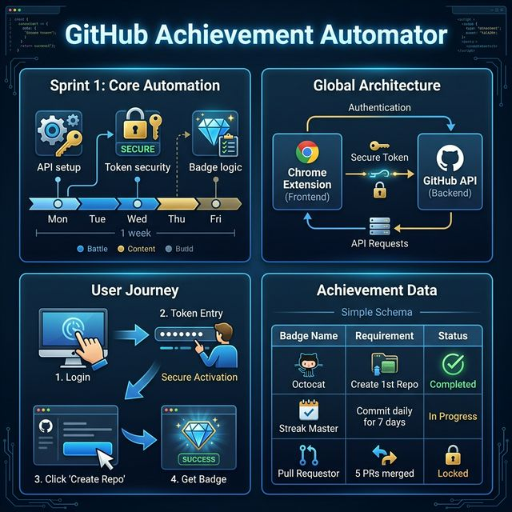

# 🏆 GitHub Achievement Automator

Unlock GitHub achievements by automating legitimate actions via the official API with this powerful Chrome Extension.



## 📑 Tabla de Contenidos
- [✨ Características Principales](#-características-principales)
- [🛠️ Arquitectura y Tecnologías](#%EF%B8%8F-arquitectura-y-tecnologías)
- [📂 Estructura del Proyecto](#-estructura-del-proyecto)
- [🚀 Guía de Instalación](#-guía-de-instalación)
- [🔑 Configuración del Token](#-configuración-del-token)
- [🗺️ Roadmap & Logros](#%EF%B8%8F-roadmap--logros)

## ✨ Características Principales
- **Automatización de Logros**: Consigue medallas como *Quickdraw*, *YOLO*, *Pull Shark*, *Pair Extraordinaire*, *Galaxy Brain* y más.
- **Gestión de Acciones**: Interfaz intuitiva para crear repositorios, issues, gists y PRs con un solo clic.
- **Seguridad**: Almacenamiento local de tokens mediante Manifest V3 (seguro y moderno).
- **Visualización**: Seguimiento en tiempo real de tus logros actuales directamente desde el popup.

## 🛠️ Arquitectura y Tecnologías
Este proyecto es una extensión de Chrome moderna diseñada para la eficiencia:


- **Manifest V3**: Estándar de seguridad y rendimiento para extensiones modernas.
- **GitHub REST API & GraphQL**: Comunicación directa y eficiente con la plataforma.
- **Vanilla JavaScript & CSS**: Sin dependencias pesadas, optimizado para ser ultra-ligero y rápido.
- **Chrome Storage API**: Gestión persistente y segura de la configuración del usuario.

## 📂 Estructura del Proyecto
```
📦 github-achievement-automator
 ┣ 📂 assets
 ┃ ┣ 📂 icons          # Iconos de la extensión en varios tamaños
 ┃ ┗ 📜 header.png     # Imagen de presentación premium
 ┣ 📜 manifest.json    # Configuración de entrada de la extensión
 ┣ 📜 api.js           # Lógica central para interactuar con GitHub
 ┣ 📜 background.js    # Service Worker para tareas en segundo plano
 ┣ 📜 popup.html       # Estructura de la interfaz de usuario
 ┣ 📜 popup.js         # Lógica de interacción de la UI
 ┗ 📜 popup.css        # Estilos visuales con estética premium
```

## 🚀 Guía de Instalación
1. Clona este repositorio o descarga el ZIP:
   ```bash
   git clone https://github.com/Chriscassiel/github-achievement-automator.git
   ```
2. Abre Google Chrome y navega a `chrome://extensions/`.
3. Activa el **Modo de desarrollador** (esquina superior derecha).
4. Haz clic en **Cargar descomprimida** (Load unpacked) y selecciona la carpeta de este proyecto.

## 🔑 Configuración del Token
Para que la extensión realice acciones en tu nombre, necesitas un **Personal Access Token**. 

### 💡 Guía Rápida (Para no expertos)
Si GitHub te parece un laberinto, simplemente sigue estos **5 pasos**:

1.  **Entra aquí**: Haz clic en 👉 [Crear mi Token](https://github.com/settings/tokens/new).
2.  **Identifícalo**: En el cuadro "Note", escribe `Prueba Automator`.
3.  **Marca 4 casillas**: Busca y activa solo estas: **repo**, **gist**, **workflow** y **user**.
4.  **Botón Verde**: Baja hasta el final de la página y dale al botón verde **"Generate token"**.
5.  **Copia y Pega**: Verás un código que empieza por `ghp_`. Cópialo y pégalo en la extensión cuando te lo pida. ¡Y ya está! 🚀

> [!TIP]
> **Token Clásico vs Fine-grained**: Recomendamos usar el **Clásico** (el link de arriba) porque es mucho más rápido de configurar y garantiza que todas las funciones de la extensión (como crear Gists o Issues) funcionen a la primera.

## 🗺️ Plan de Desarrollo (Sprints)
Para asegurar el éxito del proyecto, seguimos una metodología ágil:



### Sprint 1: Cimientos y Automatización Core (Completado)
- [x] **Configuración API**: Estructura base para llamadas a GitHub.
- [x] **Seguridad de Tokens**: Cifrado y almacenamiento local en Manifest V3.
- [x] **Lógica de Logros**: Implementación para Quickdraw, YOLO, Pull Shark y **Pair Extra**.

## 🗺️ Roadmap & Futuro
- [ ] Soporte para medallas de Discussions (Galaxy Brain).
- [ ] Soporte para Arctic Code Vault (automatizado).
- [ ] Modo oscuro automático según el sistema.
- [ ] Panel de estadísticas detalladas de actividad.

---
Desarrollado para automatizar con responsabilidad. ¡A por todos los logros! 🏆
