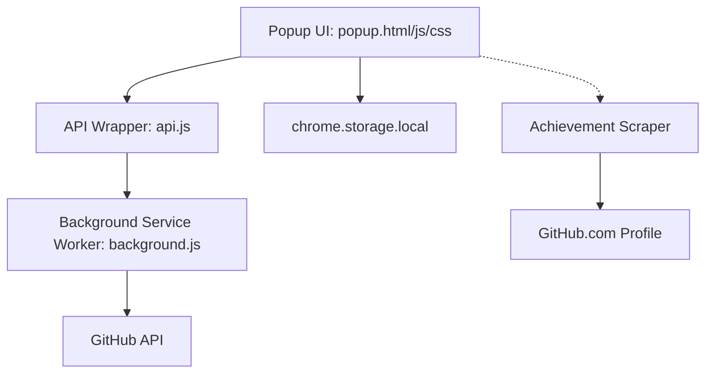

# Technical Design: GitHub Achievement Automator

## Architecture Overview

The extension follows a standard Chrome Extension architecture using Manifest V3.

## Component Breakdown

### 1. Unified API Wrapper (`api.js`)
- Encapsulates all GitHub REST API logic.
- Uses `fetch` with `Authorization` headers.
- Handles common error cases (401 Unauthorized, 403 Rate Limited).

### 2. Background Service Worker (`background.js`)
- Manages long-lived state if needed.
- Acts as a proxy for API calls if required by future CORS or security constraints.
- Initial version will primarily delegate to `api.js` directly from the popup.

### 3. Popup UI (`popup.html/js/css`)
- **Login View**: Token input and verification.
- **Dashboard View**: Grid of achievements and list of automatable actions.
- **Progress View**: Visual feedback during API calls.

### 4. Achievement Retrieval Strategy
- Since no official API exists, the `api.js` will include a `getAchievements` function that:
    1. Fetches the user's public profile HTML using the authenticated token (via `fetch` to `https://github.com/users/[username]/achievements`).
    2. Parses the HTML to extract badge data (name, icon URL).
    3. Caches result in `chrome.storage.local`.

## Data Schema

### Storage (`chrome.storage.local`)
- `github_token`: String (encrypted if possible, but standard for extensions is plain storage).
- `user_data`: Object { login, avatar_url, name }.
- `achievements`: Array of { name, icon, status }.

## Security Considerations
- **Token Scope**: Recommend "Classic" tokens with `repo`, `gist`, `workflow`, and `user` scopes.
- **HTTPS Only**: All API calls must use TLS.
- **Local Storage**: The token never leaves the user's browser except to GitHub's official API.
